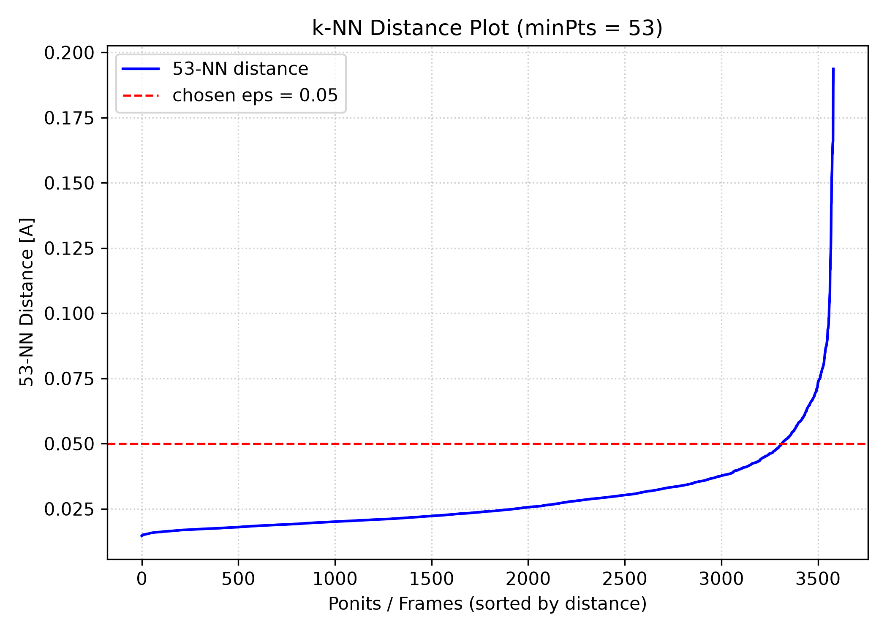
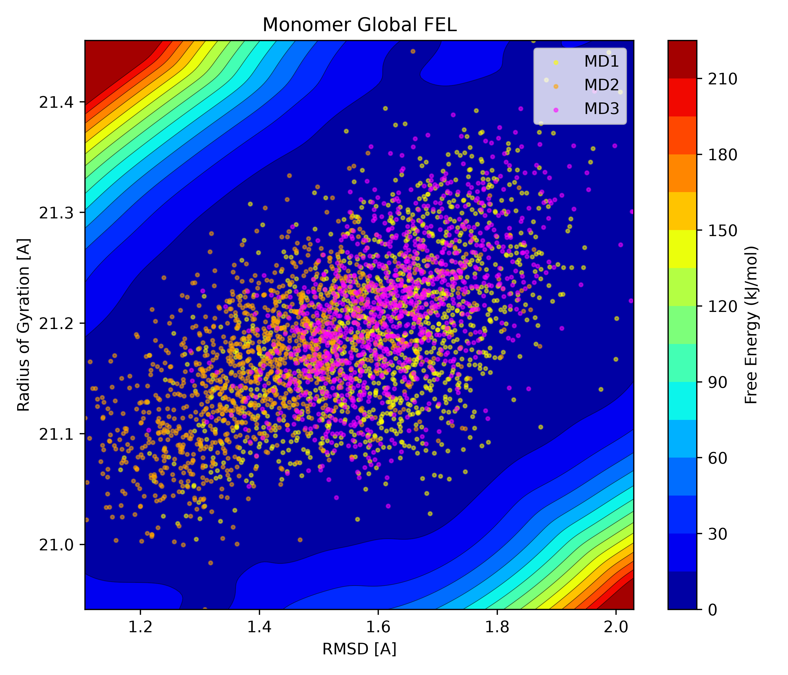

# Global Free Energy Landscape analysis in VMD

FEL analysis is usually performed to gain better sampling of rare states and smoother basins of molecular dynamics simulations. This plugin contains code for generating FEL plots and accompanying statistical data from FEL analysis of molecular dynamics simulations. The code consists of two parts: a **global_fel_gui.tcl** script for generating the GUI interface in VMD, and a Python script **fel_analysis.py** that uses DBSCAN clustering to generate FEL plots as a 2D colored contour map of RMSD and Rg values from MD simulations.

## Loading the plugin in VMD

Download this repository: [📦 Global FEL Analysis v1.0.0](https://github.com/lbuljac/FEL-analysis-in-VMD/releases/tag/v1.0.0)\
Open the Tk console and write the following commands:

``` tcl
source "full-path-to-downloaded-rep/vmd_global_fel_analysis/global_fel_gui.tcl"
::GlobalFEL::create_gui
cd full-path-to-downloaded-rep/vmd_global_fel_analysis
```

Global FEL Analysis GUI window should appear on the screen, with three options which should be adjusted according to your simulation system

**Atom Selection** - selection text accepted by VMD, for example, *protein and name CA*\
**eps** - maximum distance radius around any given data point\
**minPts** - minimum number of data points required within an eps radius to define a dense region

**Suggestion**: Set a value of minPts at around 1 - 2 % of the total number of frames in all MD simulation replicas which will be analyzed.

## Starting the FEL analysis

Enter the atom selection text of your simulation system. Set the minPts parameter at the suggested value. Set the eps parameter at a small value, try 0.05. Then click the "Set DBSCAN parameters" to generate the k-NN distance plot. Chosen value of eps parameter showed as the red dashed line should intersect the curve roughly at the knee. Then click at the "Run Analysis" button which does the FEL analysis of your simulation replicas and generates accompanying FEL plot as RG-RMSD colored contour map.

Here is an example for monomer of protein with 3 simulation replicas, eps = 0.05 and minPts = 53.
Generated k-NN distance plot with "good" DBSCAN parameters:



RG-RMSD based FEL colored contour plot:



Beside the FEL plot, two additional .txt files are generated after the analysis; **Cluster_stats_monomer.txt** and **Rep_frame_monomer.txt**. Cluster_stats_monomer.txt contains info about cluster/s which DBSCAN algorithm assigns based on the RMSD and RG values. File contains info on cluster's population state, mean values of RMSD and RG and estimated Free Energy value. Rep_frame_monomer.txt extracts the representative frame from the representative MD replica from each cluster, having FE equal to or approximately 0. These files help to support the conclusions about the lowest energy states from FEL plot.

## Important notes

This plugin is developed for 3 molecular dynamics simulation replicas of one protein system, which need to be loaded in VMD sequentially, with molecule IDs in order 1 - 3. If you have more simulation replicas with different molecule IDs, modify the global_fel_gui.tcl and fel_analysis.py script accordingly. The referent molecule has its molecule ID set at 0, so consider loading it first when starting the VMD, or change its molecule ID in mentioned .tcl and .py script.

## Requirements

Visual Molecular Dynamics (VMD) software from Theoretical and Computational Biophysics Group \
Python \
Python packages: numpy, pandas, scipy, scikit-learn and matplotlib
